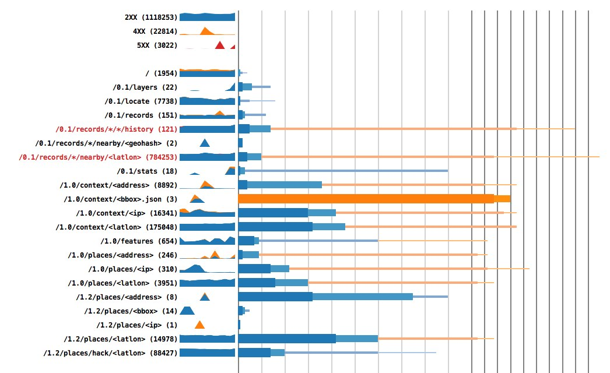

# Statsny

Ephemeral API stats.

## How to run

    virtualenv .
    . bin/activate
    pip install -r requirements.txt
    python setup.py develop
    twistd -ny statsny/__init__.py

You can insert some example data by running `test.sh`

    ./test.sh

## How to record stats

### HTTP Request Stats

Send a JSON payload to the TCP or UDP port. Example payload:

    {
        "endpoint":  "/users/:user", // Endpoint to group by on dashboard
        "method":    "GET",          // HTTP method
        "code":      200,            // HTTP response code
        "elapsed":   100,            // ms elapsed

        // Optional, lets you record timing stats for functions
        "stats": {
            "load-user-from-db": 1000, // ms elapsed
            "validate-token":    50
        },

        // Optional, lets you group all related requests by a tag
        "groups": {
            "product": "users" // "product" is a special key used by the dashboard
        },

        // Fields only shown in details page in UI (can help with debugging 500s)
        "timestamp": 1234567890000,  // epoch in ms
        "path":      "/users/alice",
        "ip":        "127.0.0.1",

        // Any extra fields you add will be visible on request details page
        "request_id": "ABCDEF012345"
    }
